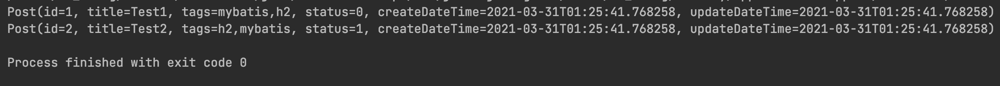

> 本文内容参考自 MyBatis[官方文档](https://mybatis.org/mybatis-3/zh/index.html)。

## MyBatis 简介

> MyBatis 是一款优秀的持久层框架，它支持自定义 SQL、存储过程以及高级映射。MyBatis 免除了几乎所有的 JDBC 代码以及设置参数和获取结果集的工作。MyBatis 可以通过简单的 XML 或注解来配置和映射原始类型、接口和 Java POJO（Plain Old Java Objects，普通老式 Java 对象）为数据库中的记录。

## MyBatis 安装

要使用 MyBatis，只需将[mybatis-x.x.x.jar](https://github.com/mybatis/mybatis-3/releases)文件置于类路径（classpath）中即可。

如果使用 Maven 构建项目，只需要在 pom.xml 中添加如下内容：

```xml
<dependency>
  <groupId>org.mybatis</groupId>
  <artifactId>mybatis</artifactId>
  <version>x.x.x</version>
</dependency>
```

获取 MyBatis 最新版本有以下途径：

- [MyBatis Blog](https://blog.mybatis.org/)
- [Github Release](https://github.com/mybatis/mybatis-3/releases)
- [Maven Repository](https://mvnrepository.com/artifact/org.mybatis/mybatis)

## MyBatis 使用

> 本文中演示的 demo 项目已上传至 Github：[mybatis-demo](https://github.com/konanok/mybatis-demo)。

1. 创建 Maven 项目

> 为了方便熟悉 MyBatis，数据库选择了[H2 Database](https://www.h2database.com/html/main.html)，其最新版本查询和依赖引入方式可参考[Maven Repository](https://mvnrepository.com/artifact/com.h2database/h2)。

在 pom.xml 文件中添加好 MyBatis 和 H2 的依赖：

```xml
<?xml version="1.0" encoding="UTF-8"?>
<project xmlns="http://maven.apache.org/POM/4.0.0"
         xmlns:xsi="http://www.w3.org/2001/XMLSchema-instance"
         xsi:schemaLocation="http://maven.apache.org/POM/4.0.0 http://maven.apache.org/xsd/maven-4.0.0.xsd">
    <modelVersion>4.0.0</modelVersion>

    <groupId>org.konanok</groupId>
    <artifactId>mybatis-demo</artifactId>
    <packaging>pom</packaging>
    <version>1.0-SNAPSHOT</version>

    <properties>
        <maven.compiler.source>11</maven.compiler.source>
        <maven.compiler.target>11</maven.compiler.target>
        <h2db.version>1.4.200</h2db.version>
        <mybatis.version>3.5.6</mybatis.version>
    </properties>

    <dependencies>
        <dependency>
            <groupId>com.h2database</groupId>
            <artifactId>h2</artifactId>
            <version>${h2db.version}</version>
        </dependency>
        <dependency>
            <groupId>org.mybatis</groupId>
            <artifactId>mybatis</artifactId>
            <version>${mybatis.version}</version>
        </dependency>
    </dependencies>

</project>
```

2. 定义表结构和数据实体类

以博客文章（post）为参考对象，准备数据库表`post`以及数据实体类`Post`。

定义 post 表结构：

```sql
CREATE TABLE post(
    `id` INTEGER PRIMARY KEY AUTO_INCREMENT COMMENT '自增主键',
    `title` VARCHAR(64) NOT NULL COMMENT '文章标题',
    `tags` VARCHAR(256) NOT NULL DEFAULT '' COMMENT '文章标签，多个标签用英文逗号分割',
    `status` SMALLINT NOT NULL DEFAULT 0 COMMENT '文章状态，0-草稿状态，1-已提交，2-已发布',
    `create_date_time` TIMESTAMP NOT NULL DEFAULT CURRENT_TIMESTAMP COMMENT '创建时间',
    `update_date_time` TIMESTAMP NOT NULL DEFAULT CURRENT_TIMESTAMP COMMENT '更新时间'
);
```

定义 Post 类结构：

> 这里使用了[Lombok](https://projectlombok.org/)的`@Data`注解，来生成`get`、`set`方法。依赖引入方式可参考[Lombok Maven](https://projectlombok.org/setup/maven)。

```java
/**
 * Post实体类
 */
@Data
public class Post {
    /**
     * 主键Id
     */
    private Integer id;

    /**
     * 标题
     */
    private String title;

    /**
     * 标签
     */
    private String tags;

    /**
     * 状态
     */
    private Integer status;

    /**
     * 创建时间
     */
    private LocalDateTime createDateTime;

    /**
     * 修改时间
     */
    private LocalDateTime updateDateTime;
}
```

3. 定义映射器

定义映射接口 PostMapper：

```java
/**
 * Post映射器
 */
public interface PostMapper {

    /**
     * 插入一条post记录
     *
     * @param post
     */
    void add(Post post);

    /**
     * 查询所有post
     *
     * @return
     */
    List<Post> list();
}
```

定义 XML 映射文件 PostMapper.xml：

```xml
<?xml version="1.0" encoding="UTF-8" ?>
<!DOCTYPE mapper
        PUBLIC "-//mybatis.org//DTD Mapper 3.0//EN"
        "http://mybatis.org/dtd/mybatis-3-mapper.dtd">
<mapper namespace="org.konanok.demo.mybatis.mapper.PostMapper">
    <resultMap id="baseResultMap" type="org.konanok.demo.mybatis.entity.Post">
        <id column="id" property="id"/>
        <result column="title" property="title"/>
        <result column="tags" property="tags"/>
        <result column="status" property="status"/>
        <result column="create_date_time" property="createDateTime"/>
        <result column="update_date_time" property="updateDateTime"/>
    </resultMap>

    <insert id="add" parameterType="org.konanok.demo.mybatis.entity.Post">
        INSERT INTO post
            (title, tags, status)
        VALUES
            (#{title}, #{tags}, #{status})
    </insert>

    <select id="list" resultMap="baseResultMap">
        SELECT * FROM post
    </select>
</mapper>
```

4. 配置 MyBatis

在项目 resources 目录下新建 MyBatis 的配置文件 mybatis-config.xml，配置数据源（datasource）、事务管理（transaction）,以及刚才创建的映射器（mappers）。

```xml
<?xml version="1.0" encoding="UTF-8" ?>
<!DOCTYPE configuration
        PUBLIC "-//mybatis.org//DTD Config 3.0//EN"
        "http://mybatis.org/dtd/mybatis-3-config.dtd">
<configuration>
    <environments default="development">
        <environment id="development">
            <transactionManager type="JDBC"/>
            <dataSource type="POOLED">
                <property name="driver" value="org.h2.Driver"/>
                <property name="url" value="jdbc:h2:mem:demo"/>
                <property name="username" value="root"/>
                <property name="password" value="root12345"/>
            </dataSource>
        </environment>
    </environments>
    <mappers>
        <mapper resource="mapper/PostMapper.xml"/>
    </mappers>
</configuration>
```

5. 运行 MyBatis

首先从 XML 中构建 SqlSessionFactory 实例：

```java
SqlSessionFactory sessionFactory = new SqlSessionFactoryBuilder().build(
        Resources.getResourceAsStream("mybatis-config.xml")
);
```

通过 SqlSessionFactory 生成 SqlSession 实例：

```java
SqlSession sqlSession = sqlSessionFactory.openSession();
```

通常使用**try-with-resources**的方式来使用 SqlSession，以确保它能够及时关闭：

```java
try (SqlSession sqlSession = sqlSessionFactory.openSession()) {
    // do something...
}
```

从 SqlSession 获取 Mapper 实例：

```java
PostMapper postMapper = sqlSession.getMapper(PostMapper.class);
```

可以看到，拿到 PostMapper 的实例后，我们就可以直接调用它的方法来操作数据库了。不过在此之前，还需要先初始化 H2，否则将无法进行数据库。

从 SqlSession 中拿到 Connection 实例，再执行建表语句初始化数据库：

```java
String sql = "" +
        "CREATE TABLE post(\n" +
        "    `id` INTEGER PRIMARY KEY AUTO_INCREMENT COMMENT '自增主键',\n" +
        "    `title` VARCHAR(64) NOT NULL COMMENT '文章标题',\n" +
        "    `tags` VARCHAR(256) NOT NULL DEFAULT '' COMMENT '文章标签，多个标签用英文逗号分割',\n" +
        "    `status` SMALLINT NOT NULL DEFAULT 0 COMMENT '文章状态，0-草稿状态，1-已提交，2-已发布',\n" +
        "    `create_date_time` TIMESTAMP NOT NULL DEFAULT CURRENT_TIMESTAMP COMMENT '创建时间',\n" +
        "    `update_date_time` TIMESTAMP NOT NULL DEFAULT CURRENT_TIMESTAMP COMMENT '更新时间'\n" +
        ");";

Connection connection = sqlSession.getConnection();
connection.prepareStatement(sql).execute();
```

接下来就可以写几个用例来测试 MyBatis 的运行情况了，完整的测试代码如下：

```java
public static void main(String[] args) throws IOException, SQLException {
    SqlSessionFactory sqlSessionFactory = new SqlSessionFactoryBuilder().build(
            Resources.getResourceAsStream("mybatis-config.xml")
    );

    try (SqlSession sqlSession = sqlSessionFactory.openSession()) {

        String sql = "" +
                "CREATE TABLE post(\n" +
                "    `id` INTEGER PRIMARY KEY AUTO_INCREMENT COMMENT '自增主键',\n" +
                "    `title` VARCHAR(64) NOT NULL COMMENT '文章标题',\n" +
                "    `tags` VARCHAR(256) NOT NULL DEFAULT '' COMMENT '文章标签，多个标签用英文逗号分割',\n" +
                "    `status` SMALLINT NOT NULL DEFAULT 0 COMMENT '文章状态，0-草稿状态，1-已提交，2-已发布',\n" +
                "    `create_date_time` TIMESTAMP NOT NULL DEFAULT CURRENT_TIMESTAMP COMMENT '创建时间',\n" +
                "    `update_date_time` TIMESTAMP NOT NULL DEFAULT CURRENT_TIMESTAMP COMMENT '更新时间'\n" +
                ");";
        Connection connection = sqlSession.getConnection();
        connection.prepareStatement(sql).execute();

        Post post1 = new Post();
        post1.setTitle("Test1");
        post1.setTags("mybatis,h2");
        post1.setStatus(0);

        Post post2 = new Post();
        post2.setTitle("Test2");
        post2.setTags("h2,mybatis");
        post2.setStatus(1);

        PostMapper postMapper = sqlSession.getMapper(PostMapper.class);
        postMapper.add(post1);
        postMapper.add(post2);

        List<Post> postList = postMapper.list();
        postList.forEach(System.out::println);
    }
}
```

运行一遍之后，得到的结果也符合预期：

