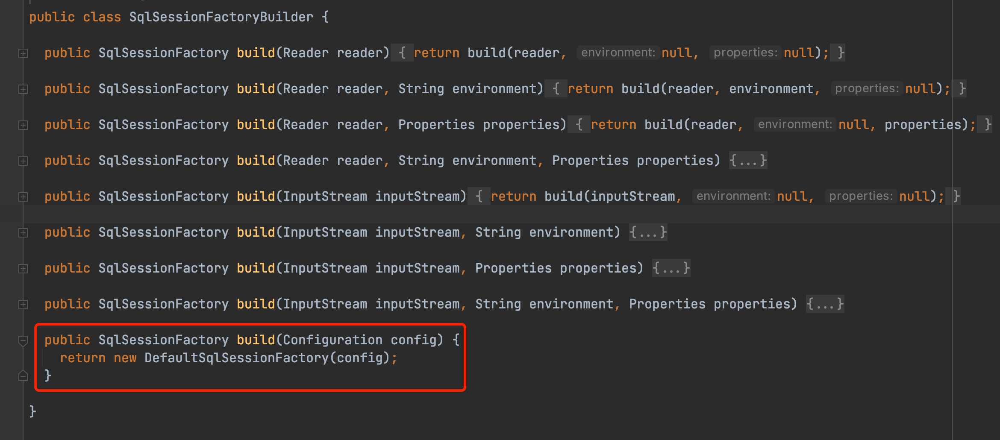
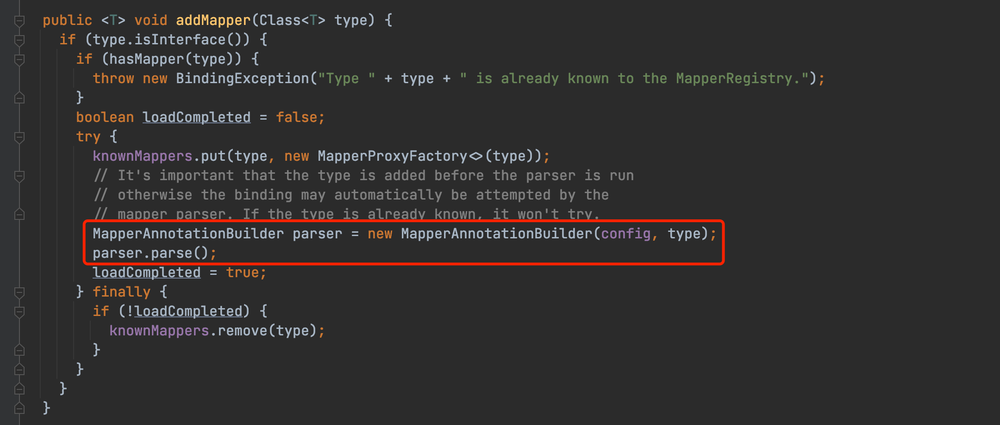
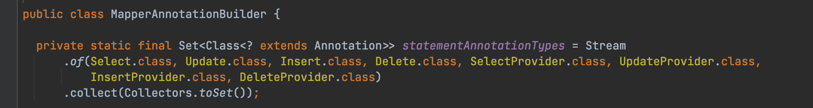
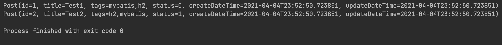

## MyBatis Java API 入门

在 [MyBatis 入门](2021-03-29-MyBatis入门.md) 这篇文章中，描述了 MyBatis 经典的使用方式，其核心配置、映射器都是在 XML 文件中配置的。除此之外，MyBatis 还提供了 [Java API](https://mybatis.org/mybatis-3/zh/java-api.html)，可以用代码的方式进行配置和使用。

下面介绍一个简单的使用纯 Java API 运行 MyBatis 的示例。

> 本文中的代码项目：[mybatis-demo/mybatis-simple-demo](https://github.com/konanok/mybatis-demo/tree/master/mybatis-simple-demo)。

### 1. 使用 Configuration 构建 SqlSessionFactory

从上篇文章已经知道 SqlSessionFactory 实例是通过 SqlSessionFactoryBuilder 来构建的，查看 SqlSessionFactoryBuilder 的源码：



可以看到，所有 build() 方法最终都调用了 build(Configuration config) 方法，即配置文件 mybatis-config.xml 会解析为 Configuration 类的一个实例，然后再通过这个实例构建出 SqlSessionFactory 实例。

构造一个 Configuration 实例：

```java
Configuration configuration = new Configuration();

JdbcTransactionFactory transactionFactory = new JdbcTransactionFactory();

JdbcDataSource dataSource = new JdbcDataSource();
dataSource.setUrl("jdbc:h2:mem:demo");
dataSource.setUser("root");
dataSource.setPassword("root12345");

Environment environment = new Environment(
         "development",
         transactionFactory,
         dataSource
);

configuration.setEnvironment(environment);
configuration.addMapper(PostMapper.class);
```

需要注意的是，configuration.addMapper() 方法只能添加映射器接口，如在此示例中添加了 PostMapper.class，而接口并不能自己关联到映射文件 PostMapper.xml，所以在这种方式下，需要使用 SQL 注解来代替 XML 文件。

通过追踪 configuration.addMapper() 方法的源代码也可以看到，其内部调用了 MapperRegistry.addMapper(Class<T> type) 这个方法，主要逻辑也是解析注解。



### 2. 使用 SQL 注解代替 XML 文件

MyBatis 支持在 Mapper 接口的方法中添加 SQL 注解，所有的注解可在 MapperAnnotationBuilder 类的源码中看到。



@Insert、 @Update、@Delete、@Select 分别对应其同名的标签，用于指定要执行的 SQL 语句；@xxxProvider 允许指定构建 SQL 的类名和方法名，从而实现更强大的 SQL 构建。

MyBaits 也支持使用注解进行结果映射：@Results 注解用于声明一组结果的映射，等价于`<resultMap>`标签；@Result 注解用于声明列和属性的单个映射，等价于`<result>`标签。

完整的 PostMapper.java 代码如下：

```java
/**
 * Post映射器
 */
public interface PostMapper {

    /**
     * 插入一条post记录
     *
     * @param post
     */
    @Insert("INSERT INTO post (title, tags, status) VALUES (#{title}, #{tags}, #{status})")
    void add(Post post);

    /**
     * 查询所有post
     *
     * @return
     */
    @Select(("SELECT * FROM post"))
    @Results(value = {
            @Result(column = "create_date_time", property = "createDateTime"),
            @Result(column = "update_date_time", property = "updateDateTime")
    })
    List<Post> list();
}
```

### 3. 运行结果

运行代码，得到的结果与使用 XML 配置的结果相同：


