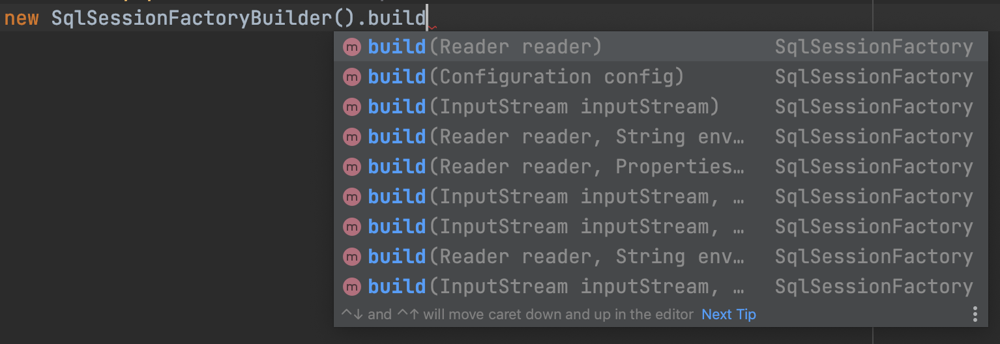
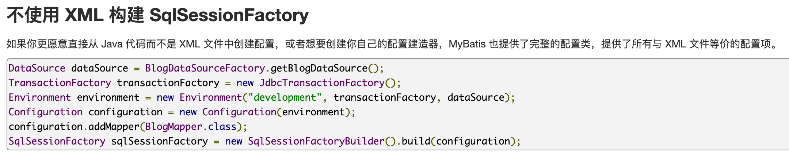

在 [MyBatis 入门](2021-03-29-MyBatis入门.md) 这篇文章中，描述了 MyBatis 经典的使用方式，其核心的配置、映射器的配置都是用 XML 文件定义的。

除此之外，MyBatis 还提供了 [Java API](https://mybatis.org/mybatis-3/zh/java-api.html)，可以使用代码的方式配置和使用。

## 从 Configuration 构建 SqlSessionFactory

已经知道 SqlSessionFactory 实例是通过 SqlSessionFactoryBuilder 来构建的，查看 SqlSessionFactoryBuilder.build()的方法签名：



可以看到 build()方法接受的参数可以分为两类：

- InputStream、Reader 是配置文件 mybatis-config.xml 的输入流。
- Configuration 是 MyBatis 的配置类。

从 MyBatis 的文档 [MyBatis3 入门](https://mybatis.org/mybatis-3/zh/getting-started.html) 中可以看到，Configuration 这个类提供了所有与 XML 文件等价的配置项。



对照之前配置的 mybatis-config.xml 文件，生成一个 Configuration 实例。代码如下：

```java
Configuration configuration = new Configuration();

JdbcTransactionFactory transactionFactory = new JdbcTransactionFactory();

JdbcDataSource dataSource = new JdbcDataSource();
dataSource.setUrl("jdbc:h2:mem:demo");
dataSource.setUser("root");
dataSource.setPassword("root12345");

Environment environment = new Environment(
         "development",
         transactionFactory,
         dataSource
);

configuration.setEnvironment(environment);
configuration.addMapper(PostMapper.class);
```

## 使用 SQL 注解代替 XML 文件

由于 Configuration 实例中只能添加映射器接口 PostMapper.java，而接口并不能自己关联到映射文件 PostMapper.xml，所以在这种方式下，需要使用 SQL 注解来代替 XML 文件。

```java
/**
 * Post映射器
 */
public interface PostMapper {

    /**
     * 插入一条post记录
     *
     * @param post
     */
    @Insert("INSERT INTO post (title, tags, status) VALUES (#{title}, #{tags}, #{status})")
    void add(Post post);

    /**
     * 查询所有post
     *
     * @return
     */
    @Select(("SELECT * FROM post"))
    @Result(column = "create_date_time", property = "createDateTime")
    @Result(column = "update_date_time", property = "updateDateTime")
    List<Post> list();
}
```

在这段代码中，@Result 注解声明了列和属性的单个映射，作用与 XML 文件中 <result> 标签相同。而与 <resultMap> 标签对应的注解是@Results。

所以上面的代码也可以这样写：

```java
/**
 * 查询所有post
 *
 * @return
 */
@Select("SELECT * FROM post")
@Results(value = {
        @Result(column = "create_date_time", property = "createDateTime"),
        @Result(column = "update_date_time", property = "updateDateTime")
})
List<Post> list();
```

运行一遍之后，得到的结果也是符合预期的：

